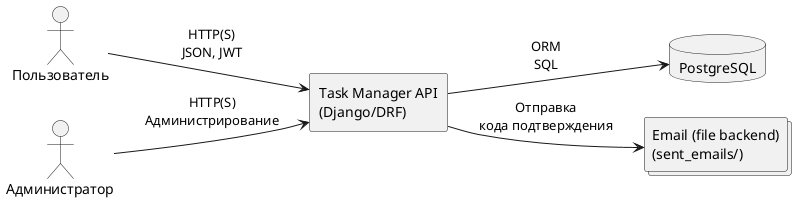
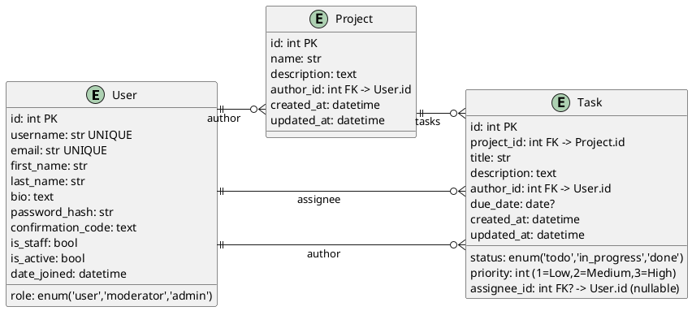
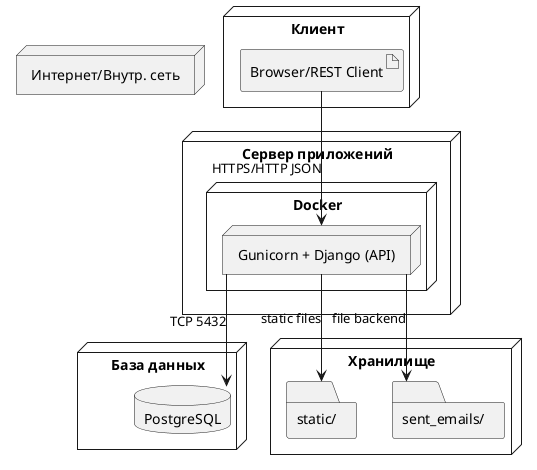
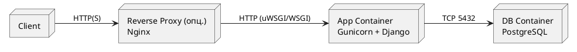
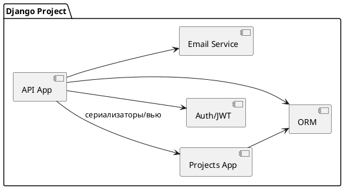

# SRS — Task Manager API (MVP)

Версия: 1.0.0

Дата: 2025‑10‑31

Ответственный: Команда разработки Task Manager API

---

## 1. Введение

### 1.1 Цель документа
Данный документ описывает требования к MVP системы управления проектами и задачами (далее — Система), реализованной на базе Django REST Framework с JWT‑аутентификацией.

### 1.2 Область применения
Документ используется для согласования функциональных и нефункциональных требований со стейкхолдерами, для проектирования и разработки backend‑части, а также как ориентир для тестирования и последующего сопровождения.

### 1.3 Определения, термины и сокращения
- Пользователь — зарегистрированное лицо, обладающее ролью: user, moderator, admin.
- Проект — сущность верхнего уровня для группировки задач.
- Задача — рабочая единица внутри проекта, имеет статус и приоритет.
- JWT — JSON Web Token, токен доступа к API.
- DRF — Django REST Framework.

---

## 2. Общее описание системы

### 2.1 Концепция продукта
Система предоставляет REST API для:
- регистрации и получения JWT‑токена;
- создания и просмотра проектов;
- создания задач в рамках проектов;
- частичного обновления задач.

#### 2.1.1 User Stories
- Как гость, я хочу зарегистрироваться по email и username, чтобы получить код подтверждения и затем JWT‑токен.
- Как авторизованный пользователь, я хочу создать новый проект, чтобы вести в нём задачи.
- Как авторизованный пользователь, я хочу добавить задачу в проект, чтобы планировать работу.
- Как автор задачи или модератор/админ, я хочу изменить статус/исполнителя задачи, чтобы управлять процессом.
- Как пользователь, я хочу просматривать свои данные и редактировать профиль (кроме роли) через /users/me/.

#### 2.1.2 Контекстная диаграмма (PlantUML)


### 2.2 Цели и задачи системы
- Обеспечить простой API для управления проектами и задачами.
- Обеспечить безопасную аутентификацию на основе JWT.
- Обеспечить разграничение прав по ролям (user/admin).

### 2.3 Целевая аудитория и пользователи
- Небольшие команды и индивидуальные разработчики.
- Внутренние сервисы, где необходим простой трекинг задач.

### 2.4 Ограничения и допущения
- MVP‑версия: отсутствуют комментарии, вложения, уведомления в реальной почте (используется файловый backend).
- База данных — PostgreSQL по умолчанию (конфигурируется env‑переменными), возможно использование SQLite для локальной разработки.
- Пагинация по умолчанию: PageNumberPagination, размер страницы — 4.

---

## 3. Архитектура и структура системы

### 3.1 Общая архитектура
Монолитное Django‑приложение (Gunicorn) с REST API (DRF), JWT‑аутентификация (SimpleJWT), БД PostgreSQL. В проде возможно использование обратного прокси (Nginx).

### 3.2 Основные компоненты и взаимодействия
- Приложение api: вьюсеты, сериализаторы, permissions, эндпоинты, redoc.html.
- Приложение projects (label=reviews): модели User, Project, Task, миграции.
- Конфигурация project_manager: настройки, URLs, шаблоны.
- Статика: OpenAPI спецификация (static/redoc.yaml), демо‑данные CSV.

### 3.3 Модель данных и ключевые сущности (ERD, PlantUML)


### 3.4 Языки, технологии и инструменты разработки
- Python 3.7, Django 2.2.x, DRF 3.12.x, SimpleJWT, django-filter.
- Документация API: ReDoc (шаблон) + статический OpenAPI (static/redoc.yaml).
- Тесты: pytest, pytest-django.
- Контейнеризация: Docker (Gunicorn). Возможна обвязка Nginx.

### 3.5 Инфраструктурная схема (Deployment Diagram, PlantUML)


#### Диаграмма Context (PlantUML)
```plantuml
@startuml
left to right direction
actor Пользователь
actor Администратор
system "Task Manager API" as System
system_db "PostgreSQL" as Postgres
boundary "Email backend (file)" as Mail

Пользователь --> System : Использует API
Администратор --> System : Управляет
System --> Postgres : Хранение данных
System --> Mail : Пишет письма (код)
@enduml
```

#### Диаграмма Container (PlantUML)


#### Диаграмма Component (PlantUML)


---

## 4. Функциональные требования

### 4.1 Требования к проектам
- Создание проекта: name (обяз.), description (опц.).
- Просмотр списка проектов с пагинацией.
- Сортировка по name (по умолчанию).
- Автор проекта задаётся автоматически (текущий пользователь).

### 4.2 Требования к задачам
- Создание задачи в проекте через /projects/{id}/tasks/.
- Поля: title (обяз.), description (опц.), status ∈ {todo,in_progress,done}, priority ∈ {1,2,3}, assignee (опц.), due_date (опц.).
- Частичное обновление задачи PATCH /tasks/{id}/.
- Право редактирования: автор, модератор, админ.

### 4.3 Требования к пользователям
- Регистрация: email + username, выдача confirmation_code (пишется в файл).
- Получение JWT по username + confirmation_code.
- Управление пользователями (админ): CRUD через /users/.
- Метод /users/me/: GET/PATCH (role — только для чтения).
- Роли: user (по умолчанию), moderator, admin.

### 4.4 Требования к API
- База URL: /api/v1/.
- Аутентификация: Bearer JWT, срок жизни access — 10 дней.
- Пагинация: PageNumber, page_size=4.
- Поиск пользователей по username (SearchFilter).
- Формат ответов — JSON, коды состояния HTTP.

### 4.5 Пользовательские сценарии (Use Cases)
- UC‑1 Регистрация и вход: POST /auth/signup/ → POST /auth/token/ → использовать JWT.
- UC‑2 Создание проекта: POST /projects/ (JWT).
- UC‑3 Просмотр проектов: GET /projects/ (публично).
- UC‑4 Создание задачи в проекте: POST /projects/{id}/tasks/ (JWT).
- UC‑5 Частичное обновление задачи: PATCH /tasks/{id}/ (автор/модератор/админ).
- UC‑6 Работа с профилем: GET/PATCH /users/me/ (JWT).

---

## 5. Техническое задание на Backend

### 5.1 Назначение и задачи backend
Предоставление REST API для управления пользователями, проектами и задачами. Обеспечение аутентификации и авторизации, валидации данных, сериализации и доступа к БД.

### 5.2 Архитектурный стиль
REST, монолитное Django‑приложение, MVC/MVT с DRF.

### 5.3 Используемые технологии
- Django 2.2.x, DRF 3.12.x, SimpleJWT.
- PostgreSQL (по умолчанию), SQLite (локально).
- Email backend: filebased (sent_emails/).

### 5.4 Основные компоненты backend
- Вьюсеты: Users, Projects, Tasks; Auth APIViews: SignUp, GetToken.
- Сериализаторы: User, Project, Task, Auth/GetToken.
- Permissions: IsAuthorOrReadOnly, IsAdminOrMe.
- Настройки: REST_FRAMEWORK (пагинация, auth, permissions).

### 5.5 Структура данных (таблицы, модели)
- User(AbstractUser): email(unique), bio, role ∈ {user, moderator, admin}, confirmation_code.
- Project: name, description, author(FK->User), created_at, updated_at.
- Task: project(FK), title, description, status, priority, author(FK->User), assignee(FK?->User), due_date?, created_at, updated_at.

### 5.6 API (эндпоинты, методы, OpenAPI спецификация)
- POST /api/v1/auth/signup/
- POST /api/v1/auth/token/
- GET/POST /api/v1/projects/
- GET/POST /api/v1/projects/{id}/tasks/
- PATCH /api/v1/tasks/{id}/
- /api/v1/users/ (админ), /api/v1/users/{username}/, /api/v1/users/me/

OpenAPI спецификация: static/redoc.yaml (доступно через /redoc/).

### 5.7 Структура проекта (папки, файлы)
```
project_manager/
  manage.py
  Dockerfile
  requirements.txt
  project_manager/
    settings.py
    urls.py
    wsgi.py
    asgi.py
  api/
    urls.py
    views.py
    serializers.py
    permissions.py
    templates/redoc.html
  projects/
    apps.py  (label='reviews')
    models.py (User, Project, Task)
    migrations/
  static/
    redoc.yaml
    data/*.csv
  sent_emails/
```

### 5.8 Нефункциональные требования backend
- Логирование ошибок и критических событий (допустимо базовое, системное).
- Конфигурация через env‑переменные: SECRET_KEY, DB_*.
- Запуск в Docker с Gunicorn, готовность к подключению Nginx.

---

## 6. Нефункциональные требования

### 6.1 Производительность
- 95‑й перцентиль отклика для простых GET (проекты, задачи) ≤ 300 мс при нагрузке до 20 rps на экземпляр.
- Создание/обновление ≤ 500 мс (95‑й перцентиль) при тех же условиях.

### 6.2 Масштабируемость
- Горизонтальное масштабирование через несколько экземпляров приложения за балансировщиком.
- БД масштабируется вертикально; резервное копирование обязательно.

### 6.3 Безопасность
- JWT в заголовке Authorization: Bearer <token>.
- Роли и permissions на уровне вью/объектов: автор задачи, moderator, admin.
- SECRET_KEY и учетные данные БД — только через переменные окружения.

### 6.4 Надёжность
- Критические операции (создание, обновление) атомарны (ORM транзакции Django).
- Файловый email‑бекенд для MVP; в проде заменить на SMTP/ESP.

### 6.5 Совместимость и развёртывание
- Контейнеризация Docker, Gunicorn; совместимо с Nginx reverse proxy.
- БД PostgreSQL 10+; локально допускается SQLite.

### 6.6 Удобство сопровождения
- Документация API — /redoc/; спецификация — static/redoc.yaml.
- Тестирование — pytest/pytest‑django.
- Кодовая организация по приложениям: api, projects, конфигурация — project_manager.

---

Примечания:
- Приложение projects имеет label='reviews' для совместимости с миграциями и ссылками AUTH_USER_MODEL='reviews.User'.
- Значения по умолчанию: DEBUG=False, ALLOWED_HOSTS='*'; следует переопределить в проде.
